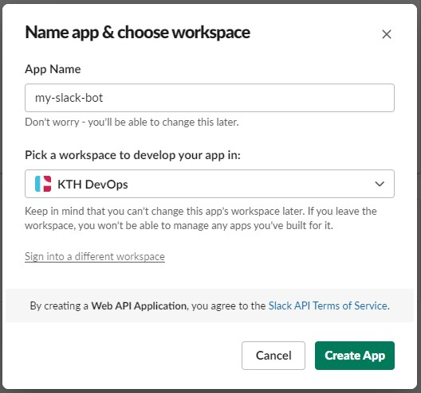
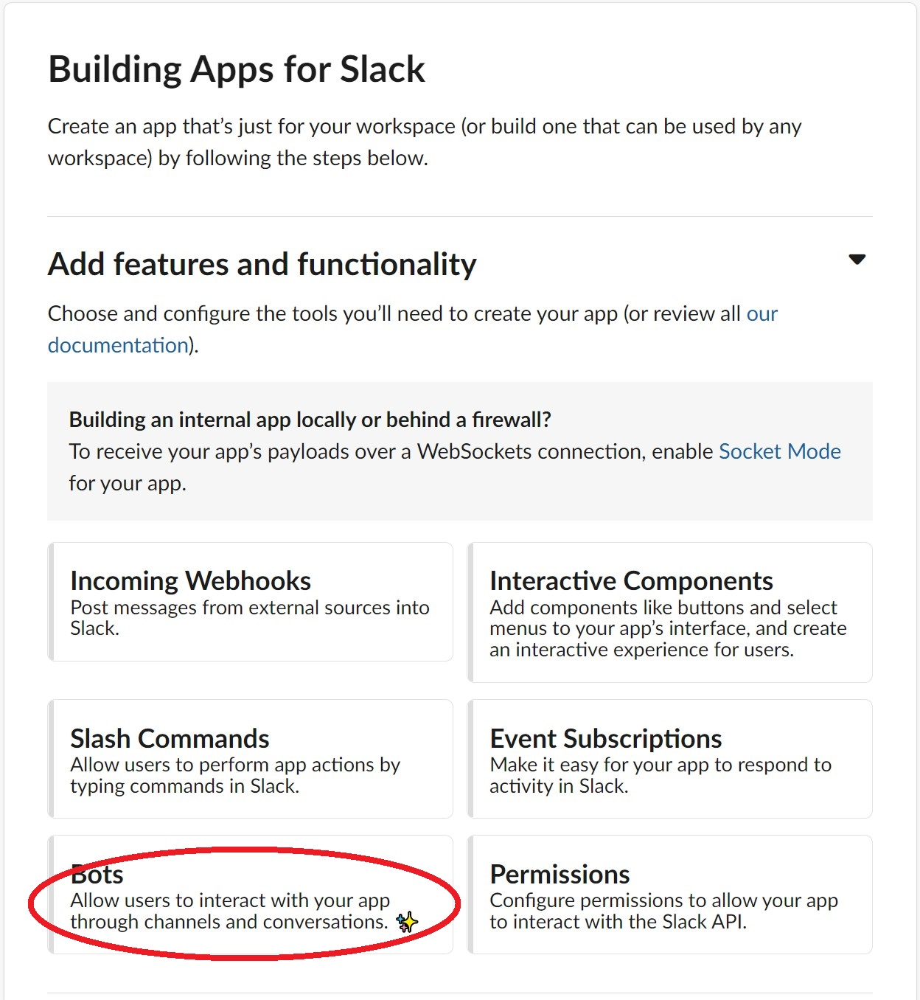
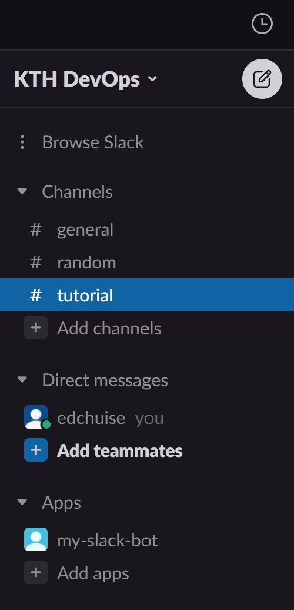

# Sending a Message via Bot

## Create an App

First go to https://api.slack.com/ to create our first app.

1. Select **"Create an app"** in the front page
2. Select **"From scratch"**
3. Give your bot a name and select the workspace you want to setup the bot
4. Select **"Create app"**

## Give Permission(s) to the App

Then we have to give the bot some permissions to send messages in our workspace. It is always a good idea to limit the resources that the bot can access (See [principle of least privilege](https://en.wikipedia.org/wiki/Principle_of_least_privilege)).

1. Under the *Basic Information* of Settings, select **"Bots"** in the menu of "Add features and functionality"
   
	
2. Select **"Review Scopes to Add"**, it will take you to *OAuth & Permissions* to review and add scopes to the app
3. Under the "Scope" section, select the scope **"chat:write.public"**, it will also select the scope **"chat:write"** automatically
4. Go to the section *OAuth Tokens for Your Workspace*, select **"Install to Workspace"**
5. Review the permission and select **"allow"**
6. After that it will generate a **Bot User OAuth Token** for you, copy it to your clipboard
   
   
7. You will then see the app is successfully added to your workspace
   
   

## Setup Environment Variable(s)

It is a good practice to set the OAuth Token as environment variable instead of purely pasting it in the Python code. [Why?](https://api.slack.com/authentication/best-practices)

1. First, create a `.env` file.
   
   `.env`{{open}}
2. Replace {{YOUR_OAUTH_TOKEN_HERE}} with your OAuth Token

   <pre class="file" data-filename=".env" data-target="replace">
   OAUTH_TOKEN={{YOUR_OAUTH_TOKEN_HERE}}
   </pre>

3. To load and use the environment variable in `.env`, we have to use the python-dotenv library

   `pip install python-dotenv`{{execute}}

   and this is the code for loading and using the environment variable

   <pre class="file" data-filename="main.py" data-target="replace">
   import os
   from dotenv import load_dotenv

   load_dotenv()
   OAUTH_TOKEN=os.getenv("OAUTH_TOKEN")

   </pre>

### Send a Message to a Channel

1. Install slack-sdk

   `pip install slack-sdk`{{execute}}

   Note that we are *NOT* using (slackclient)[https://pypi.org/project/slackclient/] in this tutorial as it is now a legacy code.

2. Import the library for the web client and exception

   <pre class="file" data-filename="main.py" data-target="prepend">
   from slack_sdk import WebClient
   from slack_sdk.errors import SlackApiError
   </pre>

3. Create a web client instance

   <pre class="file" data-filename="main.py" data-target="append">
   client = WebClient(token=OAUTH_TOKEN)

   </pre>

4. Create a function for sending message to a specific channel

   This function takes the channel ID and the message to be sent as the parameter.
   Channel ID should looks something like "C0XXXXXX", you will learn how to get it in the next step.

   <pre class="file" data-filename="main.py" data-target="append">
   def send_message(channel, message):
      try:
         response = client.chat_postMessage(
            channel=channel,
            text=message
         )
      except SlackApiError as e:
         assert e.response["error"]
   </pre>

5. Getting the channel ID
   1. Right click the channel that you want to send a message to
   2. Select **"Open channel details"**
   3. Your channel ID is in the bottom of the popup box, it should looks something like "C0XXXXXX"
   4. Copy your channel ID

6. Send a message

   To send a message, replace "C0XXXXXX" with your channel ID

   <pre class="file" data-filename="main.py" data-target="append">
   send_message("C0XXXXXX", "Hello world, nice to meet you!")
   </pre>

7. Try execute it

   `python main.py`{{execute}}

   You can now see that the message is sent to the channel.

   
