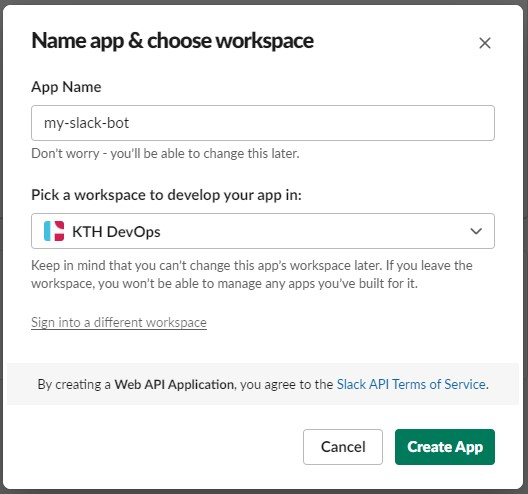
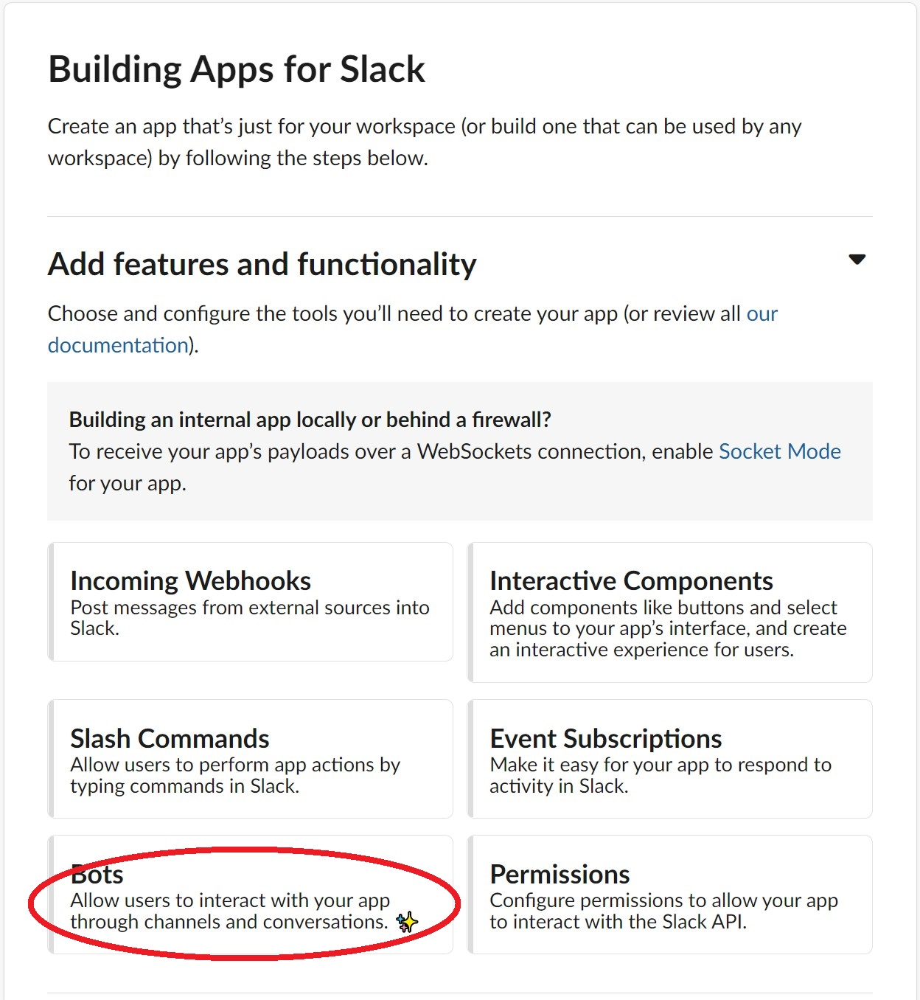
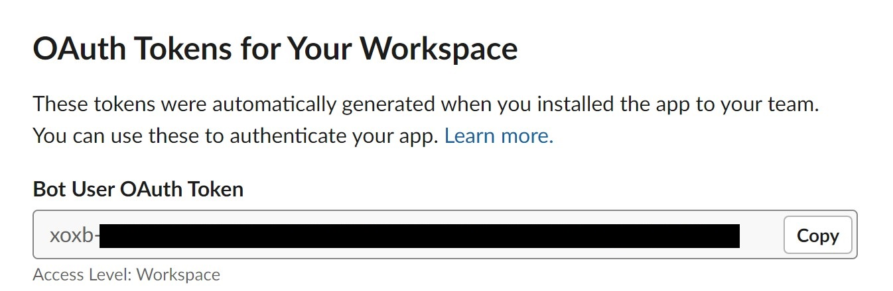
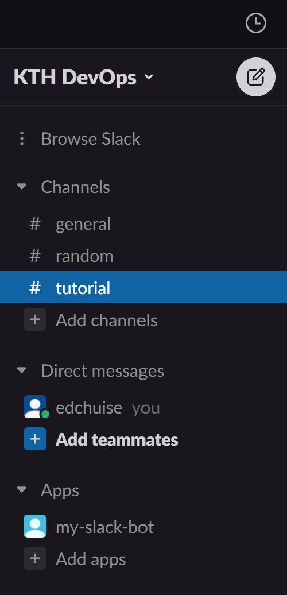

# Sending a Message via Bot

## Create an App

First go to https://api.slack.com/ to create our first app.

1. Select **"Create an app"** in the front page
2. Select **"From scratch"**
3. Give your bot a name and select the workspace you want to setup the bot
4. Select **"Create app"**

## Give Permission(s) to the App

Then we have to give the bot some permissions to send messages in our workspace. It is always a good idea to limit the resources that the bot can access (See [principle of least privilege](https://en.wikipedia.org/wiki/Principle_of_least_privilege)).

1. Under the *Basic Information* of Settings, select **"Bots"** in the menu of "Add features and functionality"
   
	
2. Select **"Review Scopes to Add"**, it will take you to *OAuth & Permissions* to review and add scopes to the app
3. Under the "Scope" section, select the scope **"chat:write"**
4. Go to the section *OAuth Tokens for Your Workspace*, select **"Install to Workspace"**
5. Review the permission and select **"allow"**.
6. After that it will generate a **Bot User OAuth Token** for you, copy it to your clipboard.
   
   
7. You will then see the app is successfully added to your workspace.
   
   

## Sending a Message to a Channel

### Setup Environment Variable(s)

It is a good practice to set the OAuth Token as environment variable instead of purely pasting it in the Python code.

1. First, create a `.env` file.
   
   `touch .env`{{open}}
2. Replace {{YOUR_OAUTH_TOKEN_HERE}} with your OAuth Token

   <pre class="file" data-filename=".env" data-target="replace">
   OAUTH_TOKEN={{YOUR_OAUTH_TOKEN_HERE}}
   </pre>