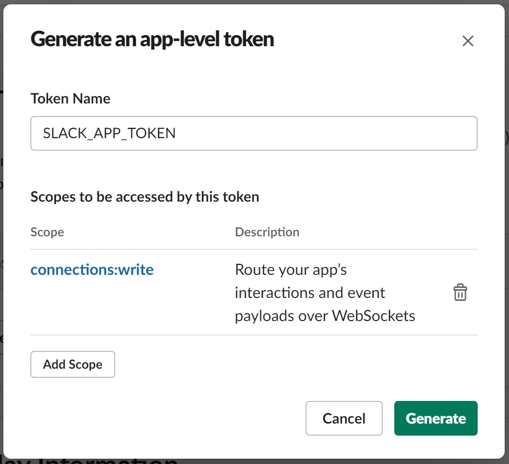

# Reply to a @mention Message

This part of the tutorial will show how the bot can send a message only when it is mentioned using [@mention](https://slack.com/help/articles/205240127-Use-mentions-in-Slack#mention-someone) feature.

From this part onward, we will use [slack-bolt](https://pypi.org/project/slack-bolt/) instead of [slack-sdk](https://pypi.org/project/slack-sdk/) and [slackeventapi](https://pypi.org/project/slackeventsapi/) as the Bolt framework is build on top of slack-sdk and covers not only the Events API, but also all the latest Slack Platform features.

## Configuration in Slack App

### Create an App Token

Before we start coding, we have to make some more configuration for our bot.

1. Go to https://api.slack.com/apps and select your app.
2. In the "Basic Information" of Settings, scroll down to the section *"App-Level Tokens"*, select **"Generate Token and Scopes"**.
3. Give your app token a name, we will name it as "SLACK_APP_TOKEN" in this tutorial.
4. Select the scope **"connections:write"**.
   
5. Generate the token and copy it to your clipboard. The token should be in the format of "xapp-xxxxxxxxxxxxxxxxxxxx".
6. Add your token to `.env`.
   
   Replace "xapp-xxxxxxxxxxxxxxxxxxxx" with your own app token.

   <pre class="file" data-filename="app/.env" data-target="append">
   SLACK_APP_TOKEN=xapp-xxxxxxxxxxxxxxxxxxxx
   </pre>

### Enable Socket Mode

1. In the left panel, select **"Socket Mode"**
2. Toggle **"Enable Socket Mode"**

## Setting up Slack Bolt

1. Install slack-bolt

   `pip install slack-bolt`{{execute}}

2. Start over with a new template
   
   <pre class="file" data-filename="app/main.py" data-target="replace">
   # TODO-import-bolt-library
   import os
   from dotenv import load_dotenv
   import re

   # Load environment variable(s).
   load_dotenv()
   SLACK_BOT_TOKEN=os.getenv("SLACK_BOT_TOKEN")
   # TODO-load-new-environment-variable

   # TODO-initialize-app

   # TODO-listen-incoming-app-mention-event

   if __name__ == "__main__":
      # TODO-main-function
   </pre>

3. Include the libraries for Slack Bolt

   <pre class="file" data-filename="app/main.py" data-target="insert" data-marker="# TODO-import-bolt-library">
   from slack_bolt import App
   from slack_bolt.adapter.socket_mode import SocketModeHandler
   </pre>

4. Load the newly added environment variable

   <pre class="file" data-filename="app/main.py" data-target="insert" data-marker="# TODO-load-new-environment-variable">
   SLACK_APP_TOKEN=os.getenv("SLACK_APP_TOKEN")</pre>

5. Initialize the app with the bot token

   <pre class="file" data-filename="app/main.py" data-target="insert" data-marker="# TODO-initialize-app">
   app = App(token=SLACK_BOT_TOKEN)</pre>

6. Start the app in the main function
   
   <pre class="file" data-filename="app/main.py" data-target="insert" data-marker="# TODO-main-function">
   SocketModeHandler(app, SLACK_APP_TOKEN).start()
   </pre>

7. Try running the App
   
   You can try to see if the app is running by 

   `python main.py`{{execute interrupt}}

   The console will output "Bolt app is running!" if everything is setup properly.

   Press "Ctrl+C" in the terminal to shutdown the app.

## Event Handling

### Subscribe to Event

As we want our bot to subscribe to @mention event, we have to enable such event subscription and write some code that the app could listen to the events.

1. Go to https://api.slack.com/apps and select your app.
2. In the left panel, select *"Event Subscriptions"* under Features.
3. Toggle "Enable Events"
4. Under **"Subscribe to bot events"**, select **"Add Bot User Event"**
5. For now, we will select **"app_mention"**, which the bot will subscribe to only the message events that mention it. You can find more events as listed in the [Slack API Documentation](https://api.slack.com/events)
6. Save the changes.
7. You might need to reinstall your app, follow the instructions to reinstall it.

## Listen to the Event

Here we will build a function using the decorator `@app.event` which will allow the bot to listen to the "app_mention" event.

When the event is triggered, a regular expression is used to check the text that sent to the bot to see if it contains the word "hello" (regardless of case). If the regex is matched, the bot will reply "Hello @username" accordingly. 

<pre class="file" data-filename="app/main.py" data-target="insert" data-marker="# TODO-listen-incoming-app-mention-event">
# Reply message that mentioned the bot.
@app.event("app_mention")
def reply_mention(event, say):
   if (re.search("hello", event["text"], re.IGNORECASE)):
      say(f"Hello <@{event['user']}>!")</pre>

We can try to run the bot with

`python main.py`{{execute interrupt}}

If you have not added the bot to the channel, Slackbot (Yes, it is a bot by Slack) will remind you to invite our bot to the channel.

After doing so, your bot should reply you whenever you mention it with the text "hello" in it.

