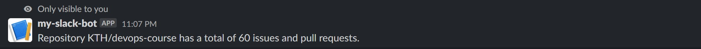

# Respond to Command

This part of the tutorial will show how the bot can respond to a "/" command and make a HTTP request to GitHub to query the total number of open issues and pull requests of a repository.

For example, by doing `/issue_count KTH devops-course` in Slack, the Slack bot will response the total number of open issues and pull requests in the repository https://github.com/KTH/devops-course.

## Configuration in Slack App

### Setup Slash Command

1. Go to https://api.slack.com/apps and select your app.
2. Under *Features* in the left panel, select **"Slash Commands"**.
3. Select "Create New Command". Here we would name our slash command to be "/issue_count".
   
4. Save the Changes.
5. You might need to reinstall your app, follow the instructions to reinstall it.

## Handle Slash Command

Now we could code our bot to handle the slash command after the setup is made.

Let's Start with a new template

<pre class="file" data-filename="main.py" data-target="replace">
from slack_bolt import App
from slack_bolt.adapter.socket_mode import SocketModeHandler

import os
from dotenv import load_dotenv
import re
# TODO-import-requests-library

# Load environment variable(s).
load_dotenv()
SLACK_BOT_TOKEN=os.getenv("SLACK_BOT_TOKEN")
SLACK_APP_TOKEN=os.getenv("SLACK_APP_TOKEN")

app = App(token=SLACK_BOT_TOKEN)

# Reply message that mentioned the bot.
@app.event("app_mention")
def reply_mention(event, say):
   if (re.search("hello", event["text"], re.IGNORECASE)):
      say(f"Hello <@{event['user']}>!")

# TODO-handle-issue-count-slash-command

if __name__ == "__main__":
   SocketModeHandler(app, SLACK_APP_TOKEN).start()
</pre>

Here we will build a function using the decorator `@app.command` which will allow the bot to handle the command being called.

<pre class="file" data-filename="main.py" data-target="insert" data-marker="# TODO-handle-issue-count-slash-command">
@app.command("/issue_count")
def get_issue_count(ack, command, respond):
# TODO-acknowledge-command-request

# TODO-split-string-into-list-as-arguments

# TODO-arguments-checking

# TODO-making-HTTP-request</pre>

Once the bot received the slash command request, it has to acknowledge it by using `ack()`:

<pre class="file" data-filename="main.py" data-target="insert" data-marker="# TODO-acknowledge-command-request">
   # Acknowledge command request.
   ack()</pre>

Then we would split the argument string into a list such that we can further process the request.

<pre class="file" data-filename="main.py" data-target="insert" data-marker="# TODO-split-string-into-list-as-arguments">
   # Split the arguments into a list.
   args = command["text"].split()</pre>

A simple checking is made to see if the number of arguments passed is correct.

<pre class="file" data-filename="main.py" data-target="insert" data-marker="# TODO-arguments-checking">
   # Check if the number of arguments matches.
   if len(args) != 2:
      respond(f"Error: expected 2 arguments, got {len(args)}.")
      return</pre>

Finally we would like to make a HTTP request to GitHub. But first we have to install and include the library `requests`.

1. `pip install requests`{{execute interrupt}}
2. 
<pre class="file" data-filename="main.py" data-target="insert" data-marker="# TODO-import-requests-library">
import requests</pre>

From the [GitHub API Documentation](https://docs.github.com/en/rest/repos/repos#get-a-repository), we can get the total number of open issues and pull requests of a repository in the attribute `open_issues_count` of the response from GET https://api.github.com/repos/OWNER/REPO.

Here we make a request to the GitHub API and will make a respond in Slack base on the HTTP response.

<pre class="file" data-filename="main.py" data-target="insert" data-marker="# TODO-making-HTTP-request">
   # Doc: https://docs.github.com/en/rest/repos/repos#get-a-repository
   response = requests.get(f"https://api.github.com/repos/{args[0]}/{args[1]}")
   if response.status_code == 404:
      respond("404 Not found!")
   elif response.status_code == 200:
      respond(f"Repository {args[0]}/{args[1]} has a total of {response.json()['open_issues_count']} issue(s) and pull request(s).")
   else:
      respond("Error!")
</pre>

Now everything is set, you can try to run the bot:

`python main.py`{{execute interrupt}}

---

Usage examples:

Response from the bot after the command `/issue_count KTH devops-course` is made in the channel, note that [KTH/devops-course](https://github.com/KTH/devops-course) is an existing repository:

Response from the bot after the command `/issue_count RickAstley giving-you-up` is made the channel, note that [RickAstley/giving-you-up](https://youtu.be/dQw4w9WgXcQ) is *not* an existing repository:

