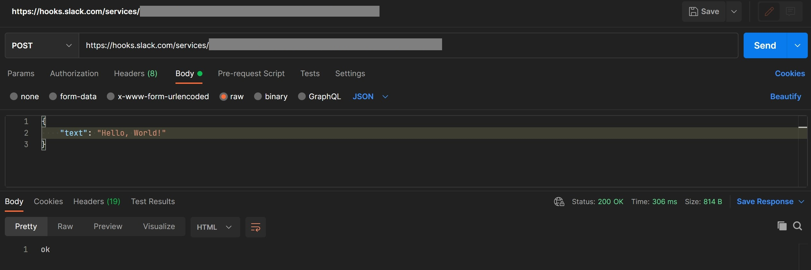

# Get Notification from GitHub

We can utilize the Webhook feature provided by the Slack app to send message to the designated channel. The webhook can only send messages into Slack and cannot access any data.

## Configuration in Slack App

### Setup Incoming Webhooks

1. Go to https://api.slack.com/apps and select your app.
2. Under *Features* in the left panel, select **"Incoming Webhooks"**.
3. Toggle **"Activate Incoming Webhooks"**.
4. Reinstall your app. Follow the instructions and select the channel the bot can post message to.
5. Copy the Webhook URL that just being generated, we will use it later.

Now you can test the webhook simply by making a POST request to the URL you just copied. Note that the request payload is a JSON data with "text" as attribute.

You can try it using the command below, replace "{{SLACK_BOT_WEBHOOK_URL}}" with your webhook URL.

`curl -X POST -H 'Content-type: application/json' --data '{"text":"Hello, World!"}' {{SLACK_BOT_WEBHOOK_URL}}`{{copy}}

Or you can use [Postman](https://www.postman.com/) to make the POST request.

## Setup GitHub Action

In the root directory of your project, create the directory `.github/workflows`

`mkdir -p .github/workflows`{{execute interrupt}}

`cd .github/workflows`{{execute interrupt}}

and create a `.yml` file for the action.

`.github/workflows/slack-notification.yml`{{open}}

In this part of the tutorial, we will start using the template below

<pre class="file" data-filename="slack-notification.yml" data-target="replace">
# TODO-action-name

# TODO-trigger-event

# TODO-jobs
</pre>

First, we need to provide our GitHub Action a name

<pre class="file" data-filename="slack-notification.yml" data-target="insert" data-marker="# TODO-action-name">
# Name of the action
name: Slack Notification</pre>

Then we need to setup the event that the action will listen to. In here, we want our bot to listen to the push and pull request made on the `main` branch of the repository.

<pre class="file" data-filename="slack-notification.yml" data-target="insert" data-marker="# TODO-trigger-event">
# Event(s) that trigger the action.
# Doc: https://docs.github.com/en/actions/using-workflows/events-that-trigger-workflows#webhook-events
on:
    push:
        branches: [ main ]
    pull_request:
        branches: [ main ]</pre>

Finally, we have to setup our job of the action.

<pre class="file" data-filename="slack-notification.yml" data-target="insert" data-marker="# TODO-jobs">
jobs:
	send_notification:
		# TODO-runs-on

		# TODO-step
</pre>

We want the action to run on the latest Ubuntu

<pre class="file" data-filename="slack-notification.yml" data-target="insert" data-marker="# TODO-jobs">
runs-on: ubuntu-latest</pre>

and now we define the step consists in the workflow. In this tutorial, we only have one step, that is, posting a message to Slack.

<pre class="file" data-filename="slack-notification.yml" data-target="insert" data-marker="# TODO-step">
        steps:
            - name: Send notification to Slack
              run: |
                curl -X POST \
                -H 'Content-type: application/json' \
                --data '{"text":"GitHub Action: Action ${{github.event_name}} is made on repository ${{github.event.repository.full_name}}."}' \
                '${{ secrets.SLACK_BOT_WEBHOOK_URL }}'</pre>
